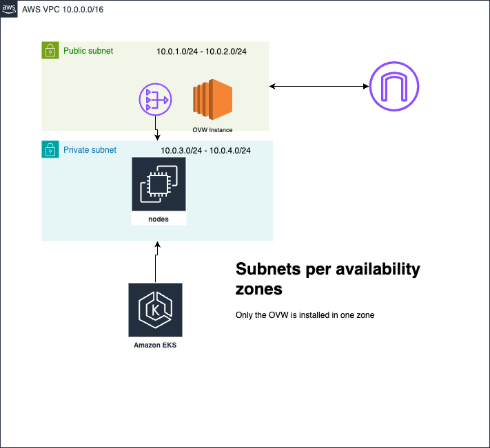

## Requirements





- Aws Account
- Aws Cli Installed
- [Eksctl](https://docs.aws.amazon.com/emr/latest/EMR-on-EKS-DevelopmentGuide/setting-up-eksctl.html) 
- Terraform Cli
- Kubernetes Cli
- helm charts

Run the following terraform projects in order.

### Global
[Backend Creation](/terraform/aws/global/README.md)

### VPC

[VPC Creation](/terraform/aws/vpc/README.md)

### EKS

[Cluster Creation](/terraform/aws/cluster/README.md)


### Omniverse 

[Omniverse Instance](/terraform/aws//ovw-instance/README.md)


Add cluster to local kubetctl
```sh
 # mac
 bash ./aws-deploy-aws-setup.sh 
```

Add mongo db chart

```sh
helm install mongodb oci://registry-1.docker.io/bitnamicharts/mongodb


```

### Next Steps Connect with MFE Project

[MicroFrontEnds and Microservices Architecture](https://github.com/JamilOmar/mfe-template)

MIT